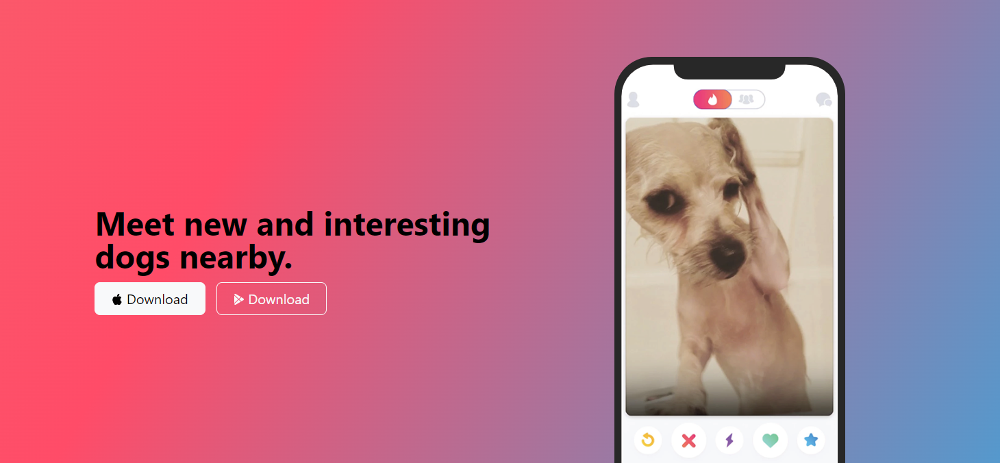
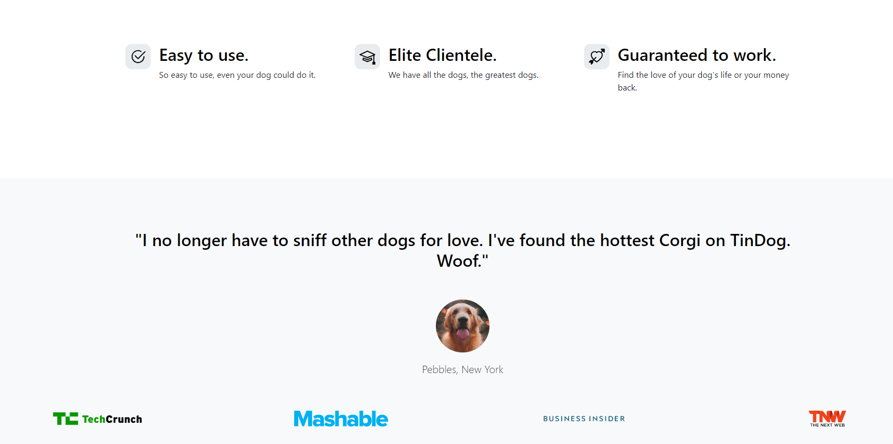
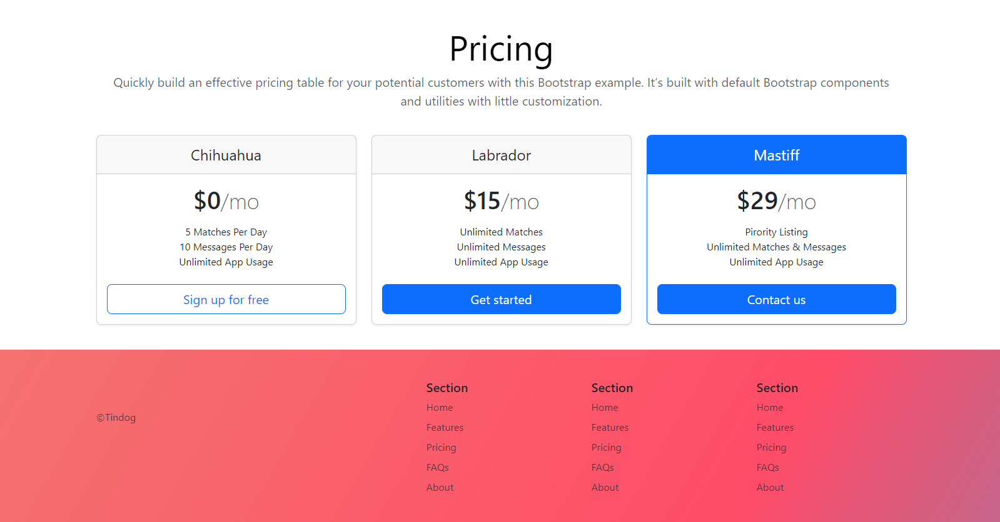

# 🐶 TinDog - Find New and Interesting Dogs Nearby! 

 
### Live Demo: [TinDog](https://rimjhimsingh.github.io/tinderforDogs/) 

## 📖 Overview

TinDog is a sleek, user-friendly platform that connects dogs and their owners to new and exciting dog friends nearby. Whether you're looking for casual playdates or something more serious, TinDog is the ultimate app for dog lovers to meet, interact, and ensure their furry friends never get bored!

This project focuses solely on the front-end design for a web page, primarily developed to practice and learn Bootstrap. It showcases how to build a fun, modern, and responsive website, offering an effortless experience for dog owners to explore matches, chat, and discover dog-friendly meetups.

Built using the latest web technologies like HTML, CSS, and Bootstrap, TinDog is a great example of how a responsive, visually appealing site can be created with minimal effort.


---

## 🚀 Technologies Used

- **HTML5** - Structuring the content of the webpage.
- **CSS3** - Styling the website and enhancing the UI design.
- **Bootstrap 5** - Rapid development of responsive layouts with pre-built components.
- **JavaScript** - Adding interactivity and dynamic content to the website.
- **Font Awesome & SVG Icons** - Adding crisp and clean icons for a professional look.

---

## 🎨 Design Highlights

1. **Responsive Layout**: Built using Bootstrap, the site adapts to all screen sizes, ensuring a consistent experience across all devices.
2. **Gradient Backgrounds**: Stunning gradient backgrounds to give the site a modern and sleek aesthetic.
3. **Pricing Section**: Attractive pricing table for different membership plans with emphasis on features.
4. **Testimonials**: A beautifully crafted testimonial section to showcase user reviews.

---

## 📷 Screenshots

### Landing Page


### Pricing Plans


---

## 🛠️ Installation

To run this project locally, follow these steps:

1. **Clone the repository**:
   ```bash
   git clone https://github.com/your-username/tindog.git
   ```
2. **Navigate to the project directory**:

    ```bash

   cd tindog
   ```
3. **Open the project in a browser**: Open index.html in your favorite browser to see the magic in action!
